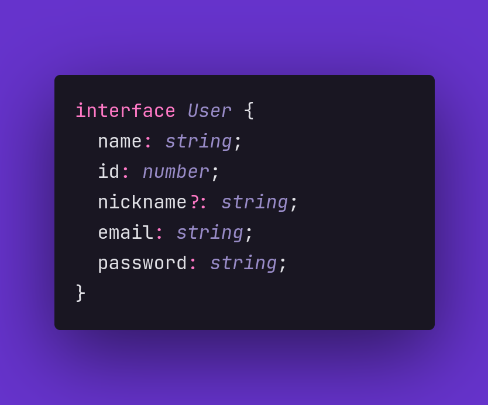

# Interfaces

Forma de organizar dados através da criação de um padrão, que por sua vez representa um grupo de tipos do TypeScript para criar um novo tipo.

  

# Configurando o ambiente e executando

Use `npm install typescript` para instalar o typescript.

Use `npm install ts-node` para instalar o ts-node.

Use `npx ts-node index.ts` para executar o arquivo.